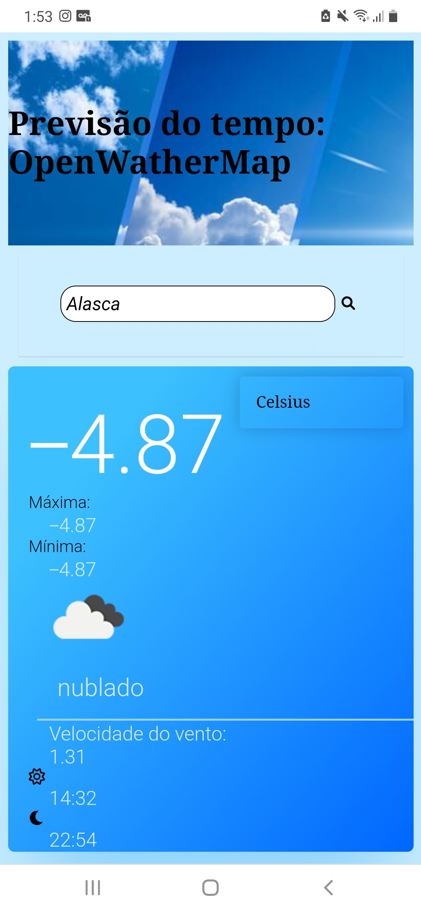
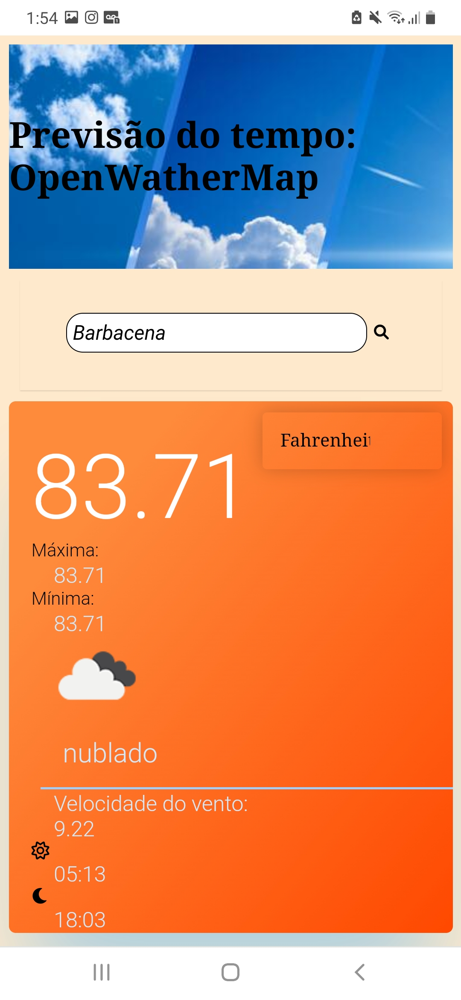
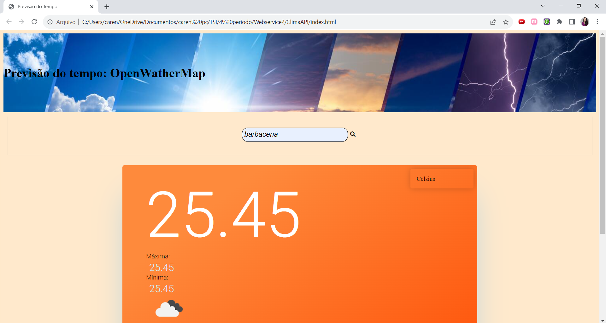

# AppClima

Projeto desenvolvido usando da API [OpenWeatherMap](https://openweathermap.org/) onde uma busca é efetuada usando o nome da cidade. O resultado mostra algumas informações a respeito do clima na cidade, como temperatura atual, máxima e mínima, uma pequena descrição do tempo além da velocidade do vento e os horário do nascer e pôr do sol.

##Ferramentas
* CSS
* HTML
* JavaScript

##Características e funcionamento
O usuário fornece o nome da cidade na barra de pesquisa, onde a mesma é efetuada pelo clique no botão de lupa ou apenas apertando 'ENTER'. É oferecida ao usuário a possibilidade de buscar a informação em diferentes escalas de temperatura: Celsius, Fahrenheit e Kelvin. A tela é responsiva, tornando possível o uso do app pelo computador opu celular.

